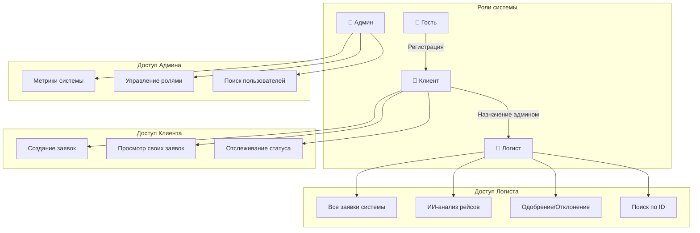
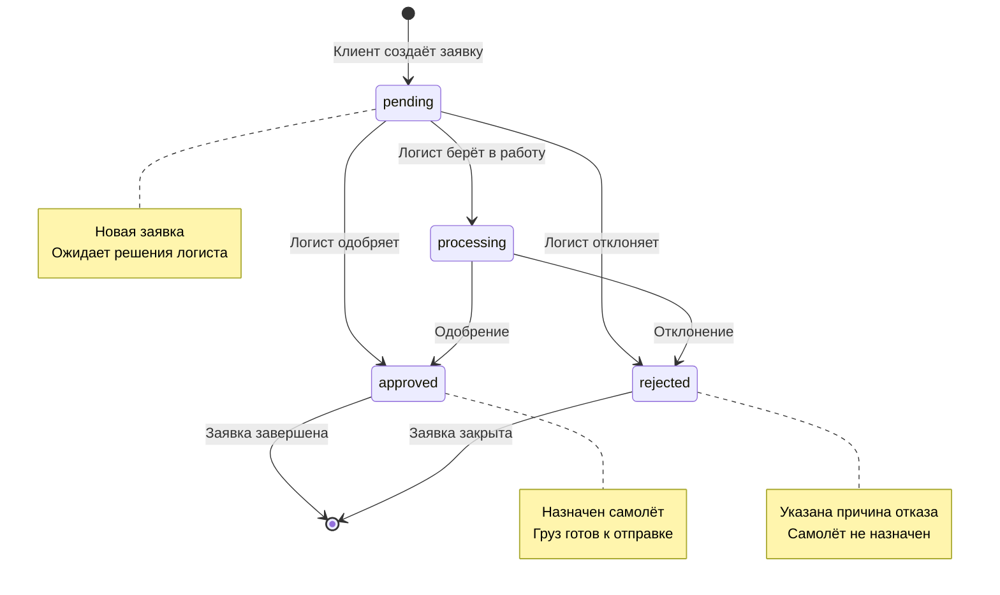
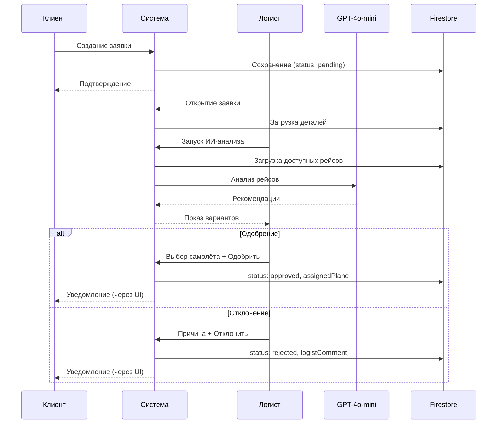
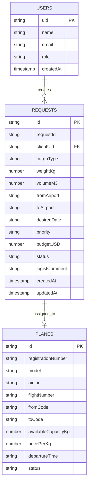
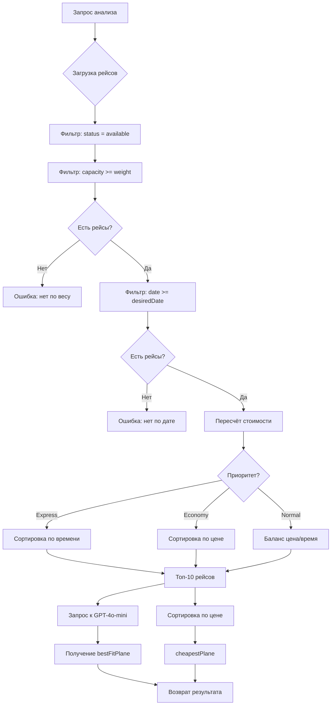

# Бизнес-логика системы EXIM KZ

## Оглавление
1. [Обзор системы](#обзор-системы)
2. [Роли пользователей](#роли-пользователей)
3. [Основные сущности](#основные-сущности)
4. [Бизнес-процессы](#бизнес-процессы)
5. [Диаграммы](#диаграммы)
6. [Правила и ограничения](#правила-и-ограничения)
7. [Интеграции](#интеграции)

---

## Обзор системы

**EXIM KZ** — платформа для управления грузовыми авиаперевозками из Казахстана по всему миру.

### Ключевые возможности:
- Создание заявок на перевозку грузов
- ИИ-анализ и подбор оптимальных рейсов
- Управление заявками логистами
- Административная панель с метриками
- Система ролей и прав доступа

---

## Роли пользователей

### 1. Клиент (client)
**Назначается:** автоматически при регистрации

**Возможности:**
- Создание заявок на перевозку
- Просмотр истории своих заявок
- Отслеживание статуса заявок
- Восстановление пароля

**Ограничения:**
- Не может видеть заявки других клиентов
- Не может изменять статус заявок
- Не имеет доступа к админ-панели

### 2. Логист (logist)
**Назначается:** администратором через админ-панель

**Возможности:**
- Просмотр всех заявок в системе
- Запуск ИИ-анализа для подбора рейсов
- Одобрение заявок с назначением самолёта
- Отклонение заявок с указанием причины
- Поиск заявок по ID
- Фильтрация заявок по статусу

**Ограничения:**
- Не может создавать заявки
- Не может управлять пользователями

### 3. Администратор (admin)
**Назначается:** вручную в базе данных Firestore

**Возможности:**
- Просмотр метрик системы (заявки по статусам, объём перевозок)
- Поиск пользователей по email/имени
- Назначение роли логиста пользователям
- Снятие роли логиста (возврат к клиенту)

**Ограничения:**
- Не может изменять роль других администраторов
- Не может изменять свою роль

---

## Основные сущности

### UserProfile (Пользователь)
```typescript
{
  uid: string;           // Firebase Auth UID
  name: string;          // Полное имя
  email: string;         // Email
  role: "client" | "logist" | "admin";
  createdAt: Timestamp;  // Дата регистрации
}
```

### CargoRequest (Заявка на перевозку)
```typescript
{
  id: string;            // Firestore document ID
  requestId: string;     // Человекочитаемый ID (REQ-XXXXX)
  clientUid: string;     // UID клиента-создателя
  clientName: string;    // Имя клиента
  clientEmail: string;   // Email клиента
  
  // Информация о грузе
  cargoType: string;     // Тип груза
  weightKg: number;      // Вес в кг
  volumeM3?: number;     // Объём в м³ (опционально)
  
  // Маршрут
  fromAirport: string;   // Аэропорт отправления
  toAirport: string;     // Аэропорт назначения
  desiredDate: string;   // Желаемая дата отправки (YYYY-MM-DD)
  
  // Дополнительно
  notes?: string;        // Особые требования
  priority: "normal" | "express" | "economy";
  budgetUSD?: number;    // Бюджет в USD
  
  // Статус и обработка
  status: "pending" | "approved" | "rejected" | "processing";
  assignedPlane?: AssignedPlane;  // Назначенный самолёт
  logistComment?: string;         // Комментарий логиста
  logistName?: string;            // Имя логиста
  
  createdAt: Timestamp;
  updatedAt: Timestamp;
}
```

### Plane (Самолёт/Рейс)
```typescript
{
  id: string;
  registrationNumber: string;  // Бортовой номер (UP-XXX)
  model: string;               // Модель самолёта
  airline: string;             // Авиакомпания
  flightNumber: string;        // Номер рейса
  
  // Маршрут
  fromCode: string;            // Код аэропорта отправления
  fromCity: string;            // Город отправления
  toCode: string;              // Код аэропорта назначения
  toCity: string;              // Город назначения
  
  // Характеристики
  maxCapacityKg: number;       // Максимальная вместимость
  availableCapacityKg: number; // Доступная вместимость
  speedKmh: number;            // Скорость
  rangeKm: number;             // Дальность полёта
  
  // Расписание
  departureTime: string;       // Время вылета (ISO)
  arrivalTime: string;         // Время прилёта (ISO)
  flightDurationHours: number; // Длительность полёта
  
  // Стоимость
  pricePerKg: number;          // Цена за кг
  totalCostUSD: number;        // Полная стоимость рейса
  
  // Возможности
  allowedCargoTypes: string[]; // Разрешённые типы грузов
  temperatureControlled: boolean;
  dangerousGoodsAllowed: boolean;
  
  status: "available" | "booked" | "departed";
  createdAt: string;
}
```

---

## Бизнес-процессы

### 1. Регистрация пользователя

```
1. Пользователь заполняет форму (имя, email, пароль)
2. Firebase Auth создаёт аккаунт
3. В Firestore создаётся документ UserProfile с role: "client"
4. Пользователь автоматически авторизуется
5. Редирект на /client
```

### 2. Создание заявки (Клиент)

```
1. Клиент заполняет форму заявки:
   - Тип груза (из списка)
   - Вес (обязательно)
   - Объём (опционально)
   - Приоритет (стандартный/экспресс/эконом)
   - Откуда (аэропорты КЗ)
   - Куда (международные аэропорты)
   - Дата отправки (обязательно)
   - Бюджет (опционально)
   - Примечания (опционально)

2. Генерируется requestId: REQ-{timestamp в base36}
3. Заявка сохраняется в Firestore со статусом "pending"
4. Клиент видит заявку в списке "Мои заявки"
```

### 3. Обработка заявки (Логист)

```
1. Логист видит заявку во вкладке "Новые заявки"
2. Открывает детали заявки
3. Запускает ИИ-анализ (опционально)
4. ИИ возвращает:
   - "По требованиям" — оптимальный рейс по приоритету клиента
   - "Самый дешёвый" — рейс с минимальной ценой за кг
5. Логист выбирает самолёт (из рекомендаций ИИ или вручную)
6. Принимает решение:
   
   ОДОБРИТЬ:
   - Выбирает самолёт
   - Статус → "approved"
   - Сохраняется assignedPlane
   - Записывается logistName и logistComment
   
   ОТКЛОНИТЬ:
   - Указывает причину
   - Статус → "rejected"
   - assignedPlane сбрасывается в null
   - Записывается причина в logistComment
```

### 4. ИИ-анализ рейсов

```
1. Загрузка рейсов из Firestore:
   - status = "available"
   - availableCapacityKg >= weightKg заявки

2. Фильтрация по дате:
   - departureTime >= desiredDate заявки
   - Если нет рейсов → возврат "Нет подходящих рейсов"

3. Пересчёт стоимости:
   - totalCostUSD = weightKg × pricePerKg

4. Сортировка по приоритету:
   - express: по flightDurationHours (↑)
   - economy: по pricePerKg (↑)
   - normal: баланс (pricePerKg × 0.6 + flightDurationHours × 0.4)

5. Отправка топ-10 в GPT-4o-mini
6. ИИ выбирает bestFitPlane с обоснованием
7. Отдельно определяется cheapestPlane
```

### 5. Назначение роли логиста (Админ)

```
1. Админ ищет пользователя по email/имени
2. Видит текущую роль пользователя
3. Нажимает "Назначить Логистом"
4. Проверка: если role === "admin" → отказ
5. Обновление документа: role = "logist"
6. Пользователь получает доступ к /logist
```

---

## Диаграммы

### Диаграмма ролей и доступа



### Жизненный цикл заявки



### Процесс обработки заявки



### Архитектура системы

```mermaid
graph TB
    subgraph "Frontend (Next.js)"
        LP[LandingPage]
        CD[ClientDashboard]
        LD[LogistDashboard]
        AP[AdminPage]
        AM[AuthModal]
    end
    
    subgraph "API Routes"
        AA[/api/analyze]
        AS[/api/seed]
    end
    
    subgraph "Внешние сервисы"
        FA[Firebase Auth]
        FS[Firestore]
        OA[OpenAI GPT-4o-mini]
    end
    
    LP --> AM
    AM --> FA
    FA --> FS
    
    CD --> FS
    LD --> FS
    LD --> AA
    AP --> FS
    
    AA --> FS
    AA --> OA
    AS --> FS
```

### ER-диаграмма данных



### Алгоритм ИИ-подбора рейсов



---

## Правила и ограничения

### Бизнес-правила

| Правило | Описание |
|---------|----------|
| Минимальный вес | Не ограничен (от 1 кг) |
| Максимальный вес | Ограничен вместимостью самолёта |
| Дата отправки | Не раньше завтрашнего дня |
| Бюджет | Опционален, учитывается ИИ при подборе |
| Приоритет | Влияет на алгоритм сортировки рейсов |

### Правила ролей

| Действие | Клиент | Логист | Админ |
|----------|--------|--------|-------|
| Создание заявки | ✅ | ❌ | ❌ |
| Просмотр своих заявок | ✅ | — | — |
| Просмотр всех заявок | ❌ | ✅ | ❌ |
| ИИ-анализ | ❌ | ✅ | ❌ |
| Одобрение/Отклонение | ❌ | ✅ | ❌ |
| Метрики системы | ❌ | ❌ | ✅ |
| Назначение логистов | ❌ | ❌ | ✅ |
| Изменение роли админа | ❌ | ❌ | ❌ |

### Статусы заявок

| Статус | Описание | Следующие статусы |
|--------|----------|-------------------|
| `pending` | Новая заявка, ожидает решения | approved, rejected, processing |
| `processing` | В обработке логистом | approved, rejected |
| `approved` | Одобрена, самолёт назначен | — (финальный) |
| `rejected` | Отклонена с причиной | — (финальный) |

---

## Интеграции

### Firebase Authentication
- Email/Password аутентификация
- Восстановление пароля через email
- Сессии управляются Firebase SDK

### Firestore Database
- Коллекции: `users`, `requests`, `planes`
- Реактивные подписки через `onSnapshot`
- Индексы не требуются (сортировка на клиенте)

### OpenAI API
- Модель: GPT-4o-mini
- Формат ответа: JSON
- Temperature: 0.2 (детерминированность)
- Max tokens: 400

---

## Аэропорты

### Отправления (Казахстан)
| Код | Город |
|-----|-------|
| ALA | Алматы |
| NQZ | Астана |
| CIT | Шымкент |
| GUW | Атырау |
| AKX | Актобе |
| UKK | Усть-Каменогорск |

### Назначения (Международные)
| Код | Город |
|-----|-------|
| SVO | Москва |
| DXB | Дубай |
| IST | Стамбул |
| PEK | Пекин |
| FRA | Франкфурт |
| LHR | Лондон |
| JFK | Нью-Йорк |
| ICN | Сеул |
| HKG | Гонконг |
| SIN | Сингапур |
| CDG | Париж |
| AMS | Амстердам |

---

## Типы грузов

1. Электроника
2. Медикаменты
3. Продукты питания
4. Промышленное оборудование
5. Текстиль
6. Химикаты
7. Ценные грузы
8. Прочее

---

## Формулы расчёта

### Стоимость перевозки
```
totalCostUSD = weightKg × pricePerKg
```

### Скоринг рейса (normal priority)
```
score = pricePerKg × 0.6 + flightDurationHours × 0.4
```
Чем ниже score — тем лучше рейс.

---

*Документация актуальна на: 14 мая 2026*
*Версия системы: 1.0*
